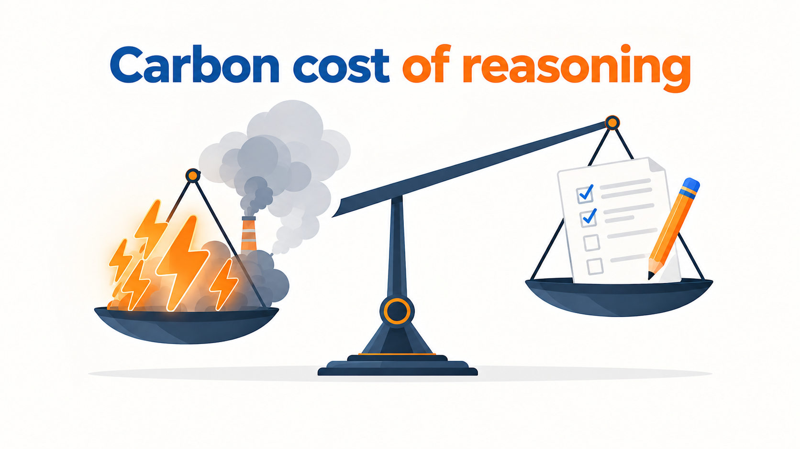
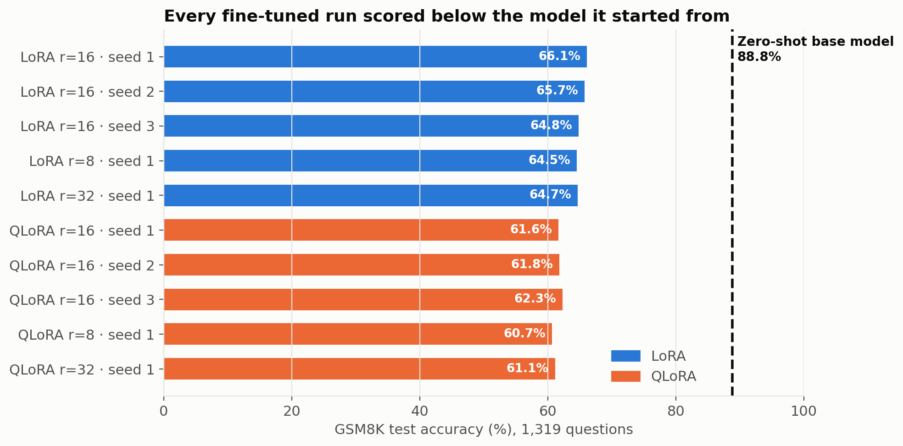
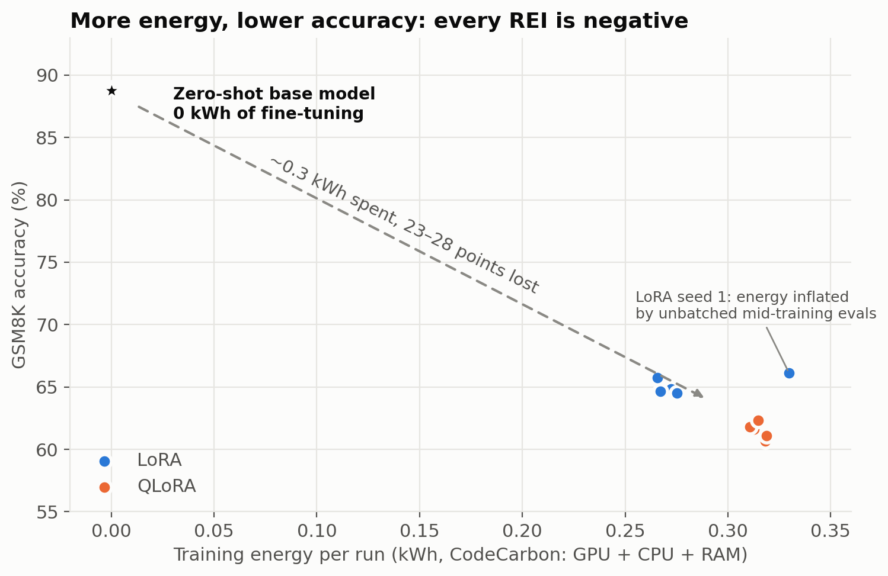
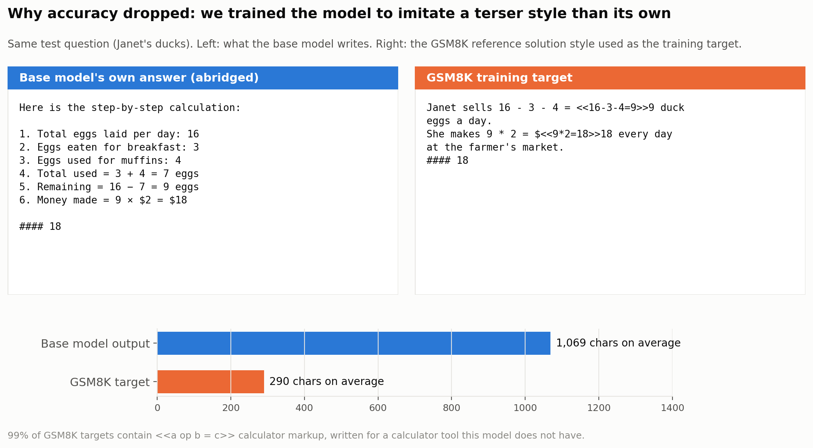

# The Green Gap: A Sustainability Analysis of Fine-Tuning Methods for Reasoning Models



## What we set out to show

Fine-tuning a language model costs energy and carbon. We wanted to measure whether that cost **buys better reasoning**, and how much each fine-tuning method buys per kWh. Two metrics were defined for this:

- **Reasoning Efficiency Index (REI):** accuracy gained over the zero-shot base model, per kWh (or per kg CO2e).
  ```
  REI = ΔAccuracy (over zero-shot base model) / Energy consumed (kWh)
  ```
- **The Green Gap:** the point in training where extra energy stops buying meaningful accuracy, read from accuracy-vs-cumulative-energy curves.

The expected result was a positive accuracy gain from fine-tuning, with parameter-efficient methods (LoRA, QLoRA) getting most of the gain for much less energy.

## What we found

We fine-tuned **`google/gemma-4-E2B-it`** on **GSM8K** with LoRA and QLoRA (3 seeds each at rank 16, plus rank 8 and rank 32 ablations: 10 runs) on an **AWS g5.xlarge** (1× A10G 24 GB, `us-east-1`), measuring energy with CodeCarbon.

**Fine-tuning made the model worse.** The instruction-tuned base model already scores **88.8%** zero-shot. Every fine-tuned model scored **61–66%**.

| Condition | Accuracy | Δ vs baseline | Training energy | CO2e | REI (/kWh) |
|---|---|---|---|---|---|
| Zero-shot base model (reference) | **88.78%** | 0 (reference point) | 0 (no fine-tuning) | 0 | n/a (no training to divide by) |
| LoRA r=16 (3 seeds) | 65.55 ± 0.66% | −23.2 pt | 0.27–0.33 kWh | ~0.11 kg | ≈ −0.8 to −0.9 |
| QLoRA r=16 (3 seeds) | 61.92 ± 0.36% | −26.9 pt | 0.31 kWh | ~0.12 kg | ≈ −0.86 |
| LoRA r=8 / r=32 | 64.5% / 64.7% | −24 pt | 0.27 kWh | ~0.10 kg | ≈ −0.89 |
| QLoRA r=8 / r=32 | 60.7% / 61.1% | −28 pt | 0.32 kWh | ~0.12 kg | ≈ −0.88 |



The whole matrix used **2.99 kWh and 1.10 kg CO2e** over 20.7 GPU-hours of training, and lowered accuracy in every run.



**Key findings**

1. **Negative REI everywhere, and the Green Gap is at zero.** By the first checkpoint (20% of training) accuracy was already 30–36 points below the base model on the same questions, and it never recovered. In this setup no amount of energy bought improvement.
2. **Why: the training data teaches a weaker reasoning style than the model already has.** The base model solves problems with long, self-checking explanations (~1,070 characters). The GSM8K reference solutions are terse (~290 characters) and full of `<<48/2=24>>` calculator markup written for a tool our model doesn't have. Fine-tuning makes the model imitate them. Per question, fine-tuning broke about 350–400 problems the base model got right and fixed only about 40.
3. **Whether fine-tuning pays off depends on the starting model and the data, not just on the method.** Supervised data whose reasoning style is weaker than the model's own makes it worse, however efficiently the method runs.
4. **QLoRA is not automatically greener.** On a GPU where LoRA already fits, QLoRA used **16% more energy** and **22% more time** (4-bit weights must be dequantized on every pass) and scored **3.4 points lower**. It only saves energy when its lower memory use lets you move to a smaller GPU.
5. **Adapter rank (8, 16, 32) made no meaningful difference** to accuracy or energy.



The evaluation was checked as a fair comparison: same prompt, chat template, decoding, batch boundaries and answer extraction for the baseline and every fine-tuned run, on the same 1,319 questions. Full methodology, per-run tables, curves, the data corrections we made and the limitations are in **[EXPERIMENT_REPORT.md](EXPERIMENT_REPORT.md)**.

## Future work

- **Train on the model's own correct answers.** Generate solutions with the base model for the training questions, keep the correct ones, and fine-tune on those, so training reinforces the model's own reasoning style instead of replacing it. The energy for generating the data counts toward that method's REI.
- **Switch to the non-instruction-tuned base model (`google/gemma-4-E2B`).** It starts far lower, so GSM8K fine-tuning should give a positive gain. This is the classic setting for measuring energy per point gained.
- Smaller follow-ups: save generated text in eval records to confirm the explanation above directly; compute loss on the answer only; strip calculator markup; try a lower learning rate or a single epoch; run the Full Fine-Tuning condition on an L40S (g6e.xlarge).

---

## Project status

| Condition | Status |
|---|---|
| Zero-shot baseline (`gemma-4-E2B-it`) | Done: 88.78% on the full GSM8K test set |
| LoRA r=16 × 3 seeds, r=8, r=32 | Done (g5.xlarge) |
| QLoRA r=16 × 3 seeds, r=8, r=32 | Done (g5.xlarge) |
| Full Fine-Tuning × 3 seeds | Not run: needs a 48 GB GPU (g6e.xlarge planned) |

Results from the g5.xlarge run are in `results-g5-backup/` (not tracked in git; it holds 2.2 GB of checkpoints).

---

## Repository structure

```
├── README.md                 # this summary
├── EXPERIMENT_REPORT.md      # full report: setup, results, analysis, limitations
├── CHANGES.md                # pipeline decisions and fixes, with reasoning
├── energy_fix.md             # energy-accounting fixes for crash/resume
├── gpu verification.md       # GPU checks run before the matrix
├── configs/                  # full_ft.yaml, lora.yaml, qlora.yaml
├── src/
│   ├── data.py               # GSM8K loading, chat-template prompts, tokenization
│   ├── models.py             # model loading, LoRA/QLoRA adapters, Full FT freezing
│   ├── train.py              # unified training entrypoint (method chosen by config)
│   ├── evaluate.py           # batched generation, answer extraction, scoring
│   ├── energy_tracker.py     # CodeCarbon wrapper, NVML power poller, per-session logs
│   └── metrics.py            # REI and Green Gap curve calculation
├── scripts/
│   ├── measure_baseline.py   # zero-shot baseline (resumable)
│   ├── run_experiment.py     # one condition + a metrics.csv row
│   ├── run_matrix.sh         # the full matrix (GG_METHODS filters by method)
│   ├── smoke_test.py         # tiny end-to-end run for a Colab T4
│   └── verify_*.py, diagnose_*.py, inspect_*.py, check_*.py   # one-off verification tools
├── analysis/plots.py         # accuracy-vs-energy and Green Gap plots
├── tests/                    # CPU unit tests (batching, energy accounting)
└── results/                  # live output dir: runs/, emissions/, metrics.csv
```

---

## Method in brief

- **Data:** `openai/gsm8k` `main`: 7,473 train / 1,319 test.
- **Prompt:** one user turn through Gemma's chat template:
  ```
  Question: {question}
  Answer: Let's think step by step. End your response with only: #### <number>
  ```
  Training target: the GSM8K reference solution as the assistant turn.
- **Scoring:** numeric exact match on the number after `####`, greedy decoding, `max_new_tokens=768`, batch 16.
- **Shared training config:** 3 epochs, effective batch 16 (2 × 8 accumulation), LR 2e-4, max length 512, bf16, gradient checkpointing.
  - LoRA: bf16 frozen base, r=16, α=32, dropout 0.05.
  - QLoRA: the same adapter on a 4-bit NF4 base.
  - Full FT (not yet run): backbone only (1.88B of 5.1B params), LR 2e-5.
- **Energy:** CodeCarbon (GPU + CPU + RAM, regional grid intensity of 0.369 kg CO2e/kWh for us-east-1) wrapped around training, including the mid-training checkpoint evals. The final 1,319-question eval is outside the tracked window. An NVML poller gives cumulative GPU energy at each 20% checkpoint for the Green Gap curve.

---

## Reproducing

### Setup

```bash
pip install -r requirements.txt
```

`peft>=0.19` is required: older versions can't wrap Gemma-4's `Gemma4ClippableLinear`.

### 1. Smoke test (free Colab T4, pipeline check only)

```bash
python scripts/smoke_test.py --method qlora
python scripts/smoke_test.py --method lora
```

Numbers from this are not results. Full FT cannot run on a T4.

### 2. Zero-shot baseline (GPU)

```bash
python scripts/measure_baseline.py --n_eval_samples 50 --batch_size 16   # quick check
python scripts/measure_baseline.py --batch_size 16                      # full set
```

### 3. Experiment matrix

```bash
# LoRA + QLoRA on a 24 GB GPU (what we ran, on g5.xlarge)
GG_METHODS=lora,qlora GG_BASELINE_ACCURACY=0.8877937831690674 \
  GG_GPU_MODEL=A10G-24GB GG_REGION=us-east-1 ./scripts/run_matrix.sh

# Full FT on a 48 GB GPU (e.g. g6e.xlarge)
GG_METHODS=full_ft GG_BASELINE_ACCURACY=0.8877937831690674 \
  GG_GPU_MODEL=L40S-48GB GG_REGION=us-east-1 ./scripts/run_matrix.sh
```

Completed runs (those with a `result.json`) are skipped, and interrupted runs resume from their last checkpoint. Energy, CO2e, wall-clock time and peak power/memory are all aggregated across resume sessions.

### 4. Tests

```bash
python -m pytest tests/
```

---

## Reproducibility notes

- Seeds 1, 2, 3 for the core runs; seed 1 for the ablations.
- Record the exact GPU model, region and cloud provider for every run (needed for CO2e).
- After final runs, record library versions with `pip freeze > requirements_lock.txt`.

## License

Code: TBD (MIT or Apache 2.0 recommended, to match Gemma's license).
Model: Gemma 4 E2B is distributed under Apache 2.0 by Google DeepMind. Review the Gemma Terms of Use before publishing derived checkpoints.
